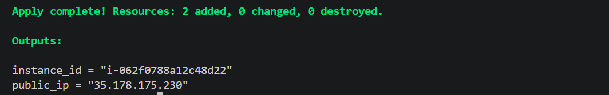
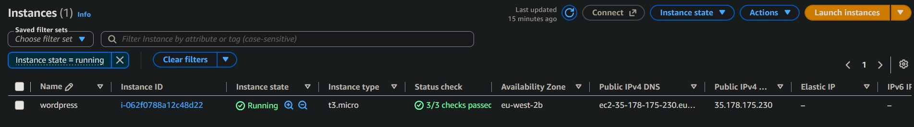
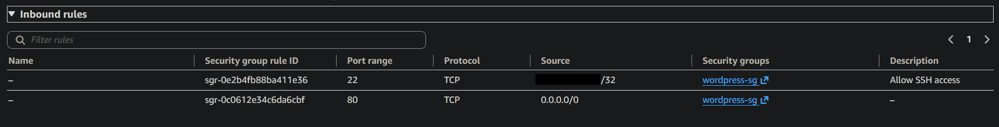
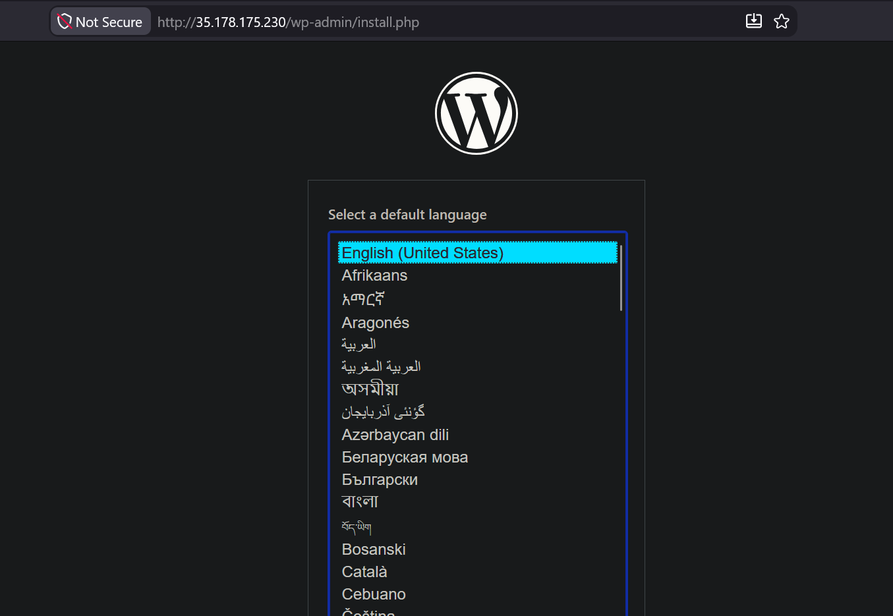

# Terraform WordPress Deployment

A simple AWS WordPress deployment provisioned entirely with Terraform.

The project demonstrates Infrastructure as Code by creating an EC2 instance, applying security group rules, bootstrapping the server with `user_data`, and automatically installing the software required to run WordPress.

## Architecture

```text
Internet
   |
   v
EC2 Security Group
   |
   +-- HTTP 80
   +-- SSH 22 from restricted CIDR
   |
   v
Amazon EC2
   |
   +-- Apache
   +-- PHP
   +-- MariaDB
   +-- WordPress
```

The deployment uses the default AWS VPC to keep the project focused on Terraform fundamentals rather than custom networking.

## Terraform Resources

The configuration provisions:

- Amazon EC2 instance
- Security group
- Dynamic Amazon Linux 2023 AMI lookup
- EC2 `user_data` bootstrap script
- Terraform input variables
- Terraform outputs

## Project Structure

```text
.
├── cloud-init.sh
├── main.tf
├── outputs.tf
├── provider.tf
├── terraform.tfvars.example
├── variables.tf
└── screenshots/
    ├── 01-terraform-apply-outputs.png
    ├── 02-ec2-instance.png
    ├── 03-security-group.png
    └── 04-wordpress.png
```

## AMI Selection

Instead of hardcoding an AMI ID, Terraform dynamically retrieves the latest matching Amazon Linux 2023 AMI:

```hcl
data "aws_ami" "amazon_linux" {
  most_recent = true
  owners      = ["amazon"]

  filter {
    name   = "name"
    values = ["al2023-ami-2023.*-x86_64"]
  }

  filter {
    name   = "virtualization-type"
    values = ["hvm"]
  }
}
```

The EC2 instance then references the returned AMI:

```hcl
ami = data.aws_ami.amazon_linux.id
```

This avoids tying the configuration to a single regional AMI ID.

## Security

The security group allows:

- HTTP on port `80` from `0.0.0.0/0`
- SSH on port `22` only from a specified `/32` CIDR
- all outbound traffic

The SSH CIDR is supplied through a Terraform variable rather than being hardcoded in the configuration.

Example:

```hcl
variable "ssh_cidr" {
  description = "CIDR block allowed to SSH to the EC2 instance"
  type        = string
}
```

The real value is stored locally in `terraform.tfvars`, which is excluded from Git.

A safe example is provided in:

```text
terraform.tfvars.example
```

## WordPress Bootstrap

The EC2 instance uses a shell script supplied through Terraform `user_data`.

The script:

1. Updates installed packages.
2. Installs Apache, PHP, PHP-FPM and MariaDB.
3. Starts and enables the required services.
4. Creates the WordPress database and database user.
5. Downloads WordPress.
6. Extracts the WordPress files into the Apache document root.
7. Creates and configures `wp-config.php`.
8. Sets the correct ownership for the web files.

The instance is configured with:

```hcl
user_data_replace_on_change = true
```

This causes Terraform to replace the EC2 instance if the bootstrap script changes, ensuring the updated first-boot configuration is applied to a fresh instance.

## Variables

The deployment uses variables for configurable values such as:

```text
aws_region
instance_type
key_name
ssh_cidr
```

Local values can be supplied through:

```text
terraform.tfvars
```

Example:

```hcl
aws_region    = "eu-west-2"
instance_type = "t3.micro"
key_name      = "example-key-pair"
ssh_cidr      = "YOUR.PUBLIC.IP.ADDRESS/32"
```

`terraform.tfvars` is intentionally excluded from version control.

## Deployment

Initialize Terraform:

```bash
terraform init
```

Format the configuration:

```bash
terraform fmt
```

Validate it:

```bash
terraform validate
```

Review the execution plan:

```bash
terraform plan
```

Deploy the infrastructure:

```bash
terraform apply
```

After confirmation, Terraform provisions the infrastructure and outputs the EC2 instance details.

## Outputs

The deployment exposes:

```text
instance_id
public_ip
```

These can be displayed with:

```bash
terraform output
```

### Terraform Apply and Outputs



## AWS Deployment

The EC2 instance is provisioned successfully in AWS and runs the WordPress stack.



## Security Group

The security group allows public HTTP access while restricting SSH access to an explicitly configured source CIDR.



## WordPress

Once the EC2 bootstrap process completes, WordPress is accessible using the instance's public IPv4 address.



## Cleanup

All Terraform-managed infrastructure can be removed with:

```bash
terraform destroy
```

This ensures the EC2 instance and security group are removed when they are no longer required.

## Key Terraform Concepts Demonstrated

This project applies several core Terraform concepts:

- declarative Infrastructure as Code
- providers
- resources
- data sources
- input variables
- outputs
- Terraform state
- dependency resolution
- EC2 bootstrapping with `user_data`
- infrastructure creation and destruction
- separating environment-specific values from committed configuration

## Production Considerations

This project is intentionally scoped as a Terraform learning exercise.

A production WordPress deployment would typically improve areas such as:

- managed database services such as Amazon RDS
- encrypted and persistent storage
- secrets management
- HTTPS and TLS certificates
- load balancing
- backups
- monitoring and logging
- highly available architecture
- tighter network segmentation

The database password in this project is used for demonstration purposes and would not be suitable for production secret management.